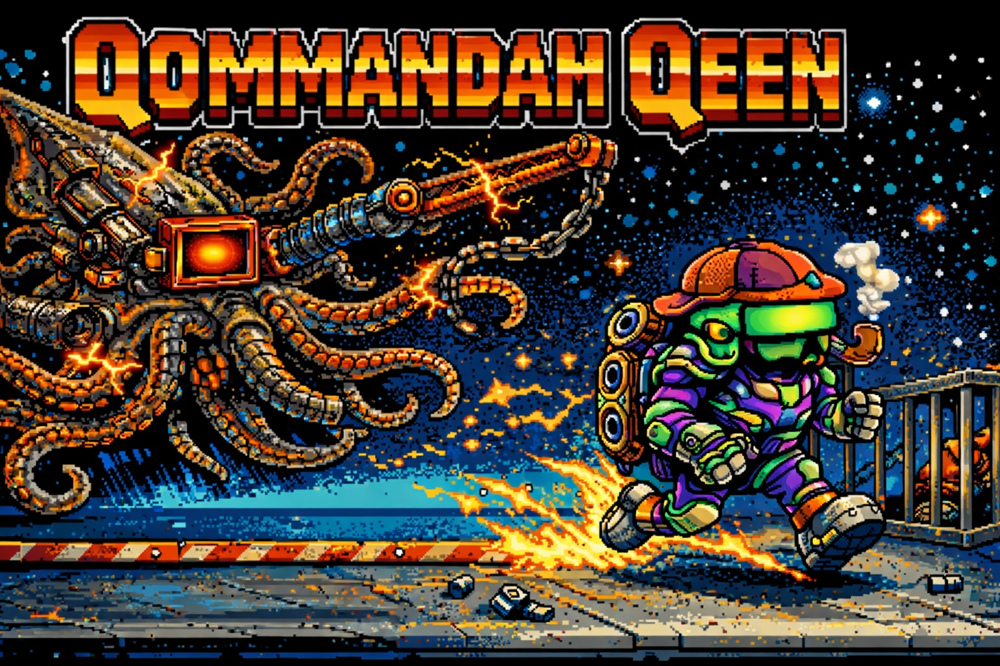

# 🎮 QommandahQeen MAQZIMUM

[](LICENSE)
[](VERSION)
[](https://python.org)
[](https://pyga.me)



> **Commander Keen-Inspired Platformer with QonQrete Aesthetics**  
> Built with 💜 using QonQrete AgentiQ OrQhestration

---

## 🚀 Quick Start

```bash
# Install dependencies
pip install pygame-ce

# Run the game
python main.py

# Toggle fullscreen with F11
```

---

## 🎮 Controls

| Key | Action |
|-----|--------|
| **Arrow Keys** / **WASD** | Move left/right |
| **Space** / **Z** / **W** / **Up** | Jump |
| **X** / **Ctrl** | Shoot |
| **E** / **Enter** | Interact (doors, mount/unmount JumpUpstiq) |
| **Escape** / **P** | Pause menu |
| **F11** | Toggle fullscreen |

### JumpUpstiq Pogo Stick
| Action | How |
|--------|-----|
| Pick up | Walk through the red pogo stick |
| Mount | Press **E** or **Enter** |
| Unmount | Press **E** or **Enter** again (drops it where you stand) |
| Re-collect | Walk through the dropped pogo stick |

> **Pro Tip:** When mounted, you jump **TWICE AS HIGH**! 🚀

---

## ✨ Features

### Player States
| State | Description |
|-------|-------------|
| **Normal** | Standard run, jump, shoot with signature smoke Q overlay |
| **JumpUpstiq** | Mountable pogo stick with 2x jump height! Drop and pick up anytime |
| **JettPaq** | Boombox jetpack for flight (hold jump to thrust, release to hover) |

### Enemies (6 Types)
| Enemy | Behavior | Damage | HP |
|-------|----------|--------|-----|
| **WalQer Bot** | Patrol + chase player | 10 | 50 |
| **Jumper DrQne** | Periodic jumping | 15 | 60 |
| **Qortana Halo** | Follow + ZAP attack | 15 | 60 |
| **Qlippy** | Annoying dialogue blocks | 10 | 30 |
| **BriQ Beaver** | Throws arcing briQs | 20 | 80 |
| **Hover Squid** | Floating figure-8 swoop | 15 | 40 |

### WoNQmodes (6 Modes)
| Mode | Effect |
|------|--------|
| **Low-G** | 50% gravity |
| **Glitch** | Screen shake, jitter |
| **Mirror** | Horizontal flip |
| **Bullet Time** | 0.3x time scale |
| **Speedy Boots** | 2x movement speed |
| **Junglist** | 174 BPM bass pulses! |

### Collectibles & Powerups
- **Chips** - Score bonus
- **Floppies** - Extra points
- **Medallions** - High value
- **Keys** - Unlock doors
- **JumpUpstiq** - Mountable pogo (2x jump!)
- **JettPaq** - Timed jetpack powerup

---

## 📁 Project Structure

```
qommandah-qeen/
├── main.py               # Entry point
├── VERSION               # Version file
├── LICENSE               # AGPL-3.0
├── README.md             # This file
├── requirements.txt      # Dependencies
│
├── actors/               # Player, enemies, projectiles
│   ├── player.py         # Main player class
│   ├── player_states/    # Normal, JumpUpstiq, JettPaq states
│   └── enemies/          # All 6 enemy types
│
├── core/                 # Engine systems
│   ├── engine.py         # Main game loop
│   ├── input.py          # Input manager
│   ├── camera.py         # Camera with smooth follow
│   └── resources.py      # Asset loading
│
├── world/                # World systems
│   ├── physics.py        # Physics calculations
│   ├── collision.py      # Collision detection
│   ├── tiles.py          # Tilemap rendering
│   └── level_loader.py   # JSON level loading
│
├── objects/              # Game objects
│   ├── collectible.py    # Chips, floppies, medallions
│   ├── key_pickup.py     # Keys for doors
│   ├── door.py           # Lockable doors
│   ├── jumpupstiq_pickup.py  # Pogo stick powerup
│   └── jettpaq_pickup.py     # Jetpack powerup
│
├── modes/                # WoNQmodes
│   ├── low_g_mode.py
│   ├── glitch_mode.py
│   ├── mirror_mode.py
│   ├── bullet_time_mode.py
│   ├── speedy_boots_mode.py
│   └── junglist_mode.py
│
├── scenes/               # Game scenes
│   ├── menu_scene.py     # Main menu
│   └── game_scene.py     # Gameplay
│
├── ui/                   # User interface
│   ├── hud.py            # Health, score, powerup bars
│   ├── main_menu.py
│   └── pause_menu.py
│
├── shared/               # Shared data
│   ├── constants.py      # Game constants
│   ├── types.py          # Enums and types
│   └── sprite_data.py    # Sprite definitions
│
├── levels/               # Level data
│   ├── level01.json
│   ├── level02.json
│   └── level03.json
│
└── assets/               # Game assets
    ├── qq-qommandah-qeen.png      # Player sprites
    ├── qq-qeen-walqin.png         # Walk animation
    ├── qq-qeen-jumpupstiq.png     # Pogo sprites
    ├── qq-qeen-jetpaq.png         # Jetpack sprites
    ├── qq-qeen-smoqin.png         # Smoke overlay
    ├── qq-walqer-bot.png          # Enemy sprites
    ├── qq-hover-squid.png
    ├── qq-briq-beaver.png
    ├── qq-jumper-drqne.png
    ├── qq-qortana-halo.png
    ├── qq-annoying-qlippy.png
    ├── qq-objects-tilesets.png    # World tiles
    ├── qq-items-collectibles.png  # Collectibles
    ├── qq-bonus-powerups.png      # Powerup sprites
    ├── qq-key-object.png          # Key sprite
    ├── qq-door-open.png           # Door sprites
    ├── qq-health-ui.png           # Health bar
    ├── qq-powerups-ui.png         # Powerup UI
    ├── qq-ui-icons.png            # UI icons
    ├── qq-main-menu.png           # Menu splash
    ├── qq-bullets-explosions.png  # Effects
    └── qq-background1-4.png       # Parallax backgrounds
```

---

## 🔧 Technical Details

### Physics System
- Float-based sub-pixel movement for smooth motion
- Gravity: 2400 units/s²
- Normal jump force: -950
- JumpUpstiq jump force: -1900 (2x!)
- 60 FPS fixed timestep

### Tile System
- 32x32 pixel tiles
- JSON-based level format
- Collision detection per-tile

---

## 📝 Changelog

### v0.5.3-alpha (Current)
- Fixed JettPaq crash (missing `import random`)
- Removed glitchy JettPaq from level 1
- Clean level progression: JumpUpstiq → Key → Door

### v0.5.2-alpha
- **JumpUpstiq is now MOUNTABLE!**
- Walk through to pick up, press E to mount/unmount
- Double jump height when mounted (1900 vs 950)
- Unmount drops pogo stick to re-collect later
- JumpUpstiq UI bar shows when available/mounted

### v0.5.1-alpha
- Fixed JumpUpstiq state crashes
- Added missing gravity and collision methods

### v0.5.0-alpha
- Fixed JumpUpstiq crash (missing InputManager import)

### v0.4.9-alpha
- Fixed invisible wall bug in horizontal collision

### v0.4.8-alpha
- Balanced jump height to -950

### v0.4.7-alpha
- **CRITICAL FIX**: Jump was hardcoded to -800, now uses constant
- Fixed jettpaq_state double-negative bug

### v0.4.6 - v0.4.3-alpha
- Enemy patrol AI fixes
- Smooth float-based enemy movement
- Jump height tuning

### v0.3.x - v0.4.x
- Walk animation (15 frames)
- Health/damage system
- Key/door mechanics
- Powerup UI bars
- Pause menu

### v0.2.x
- All 6 enemy types implemented
- Background parallax scrolling
- Fullscreen support

---

## 🎨 Credits

- **Game Design & Code**: Built with QonQrete AgentiQ OrQhestration
- **Inspiration**: Commander Keen (id Software)
- **Engine**: pygame-ce

---

## 📜 License

QommandahQeen MAQZIMUM is licensed under the **GNU Affero General Public License v3.0** (AGPL-3.0).

See the [LICENSE](LICENSE) file for full text.

---

**KABOOMAGE!!! 💥**

*yafeelme bruv* 🔥🎮
